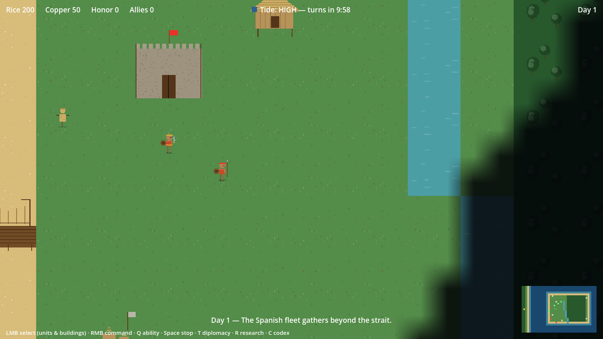

# LAKANDULA

*A Warcraft-style single-player RTS about the Battle of Mactan — April 1521.*

You are the coalition of **Lapu-Lapu, Datu of Mactan**. Ferdinand Magellan's
fleet lies at anchor off Cebu, Rajah Humabon pays the strangers tribute, and
the friars are converting the islands one barangay at a time. You are
outnumbered and outgunned — hold the island anyway.



## The game

This is a **survival and resistance** RTS, not a conquest one. Spain plays a
five-act campaign against you (sail in → land → convert → assault →
desperation) on a ~30-minute clock. You win by:

- **Killing Magellan** when he leads the assault (day 15+),
- **Starving Spanish powder** — every arquebus shot and broadside burns their finite ammunition,
- **Surviving to the monsoon** (day 60) with your fortress standing, or
- **Forging the Great Alliance** — every datu and Humabon himself at your side.

You lose if the Kuta falls, if Lapu-Lapu dies, or if Spain converts all six
villages before day 30.

Signature systems:

- **The tide** (the real battle's decisive factor): at low water the galleons
  run aground, their guns useless, while your warriors wade the open shallows
  and your karakoa runs free.
- **Utang na loob** diplomacy: gift datus to place debt tokens, call them in
  for fighters, supplies, or intel — and work the three-stage ladder that
  flips Rajah Humabon out of Spain's arms.
- Finite Spanish powder, fog of war, an 11-tech tree across three ages, hero
  abilities (Daluyong!), and a historical codex that unlocks as you play.

## Controls

| Input | Action |
|---|---|
| WASD / screen edge / minimap click | Camera |
| Mouse wheel | Zoom |
| LMB / drag | Select units or your buildings |
| RMB | Move / attack |
| Q | Ability · **Space** stop |
| T / R / C | Diplomacy · Research · Codex |

## Playing a build

Grab the latest zip for your OS from
[Releases](https://github.com/iamdusky/lakandula/releases) — each contains a
`TESTING.md` with setup notes (the builds are unsigned; macOS needs
right-click → Open the first time).

## Running from source

Requires [Godot 4.6](https://godotengine.org/). No plugins.

```sh
# Play
godot --path .

# Headless regression suite (~2 min, 166 checks, exits 0/1)
godot --headless --path . -- --smoke-test

# Regenerate the procedural assets (deterministic)
godot --headless --path . --script tools/gen_assets.gd
godot --headless --path . --script tools/gen_audio.gd
```

All art and audio are **procedurally generated placeholders** (pixel-art
sprites with walk cycles, synthesized kulintang music) — see
[ASSETS.md](ASSETS.md) for the commissioning spec that will replace them.

## Project docs

- [PLAN.md](PLAN.md) — full design, milestone history (0–12 complete), and the
  active roadmap (13–16: combat QoL, difficulty/replayability, commissioned
  assets, release engineering)
- [ASSETS.md](ASSETS.md) — asset specification for artists/composers/voice talent
- [TESTING.md](TESTING.md) — tester guide
- [CLAUDE.md](CLAUDE.md) — architecture notes (autoload managers, EventBus
  rules, map/navmesh pipeline)

## On the history

The Battle of Mactan (April 27, 1521) ended with Magellan dead in the surf
and the expedition in retreat — the first successful resistance to European
colonization in the Philippines. The game bends details for play (compressed
time, a tech tree, a flippable Humabon) but keeps the shape of the thing:
the reef and the tide, the pike-and-shot problem, the politics of utang, and
a datu who said no. Codex entries in-game carry the sourced history.

## License

Not yet decided — all rights reserved for now. Contact
[@iamdusky](https://github.com/iamdusky) before reusing code or assets.
